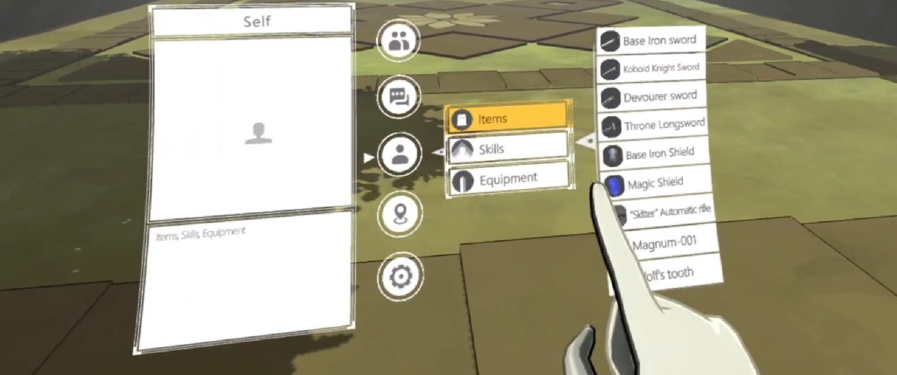
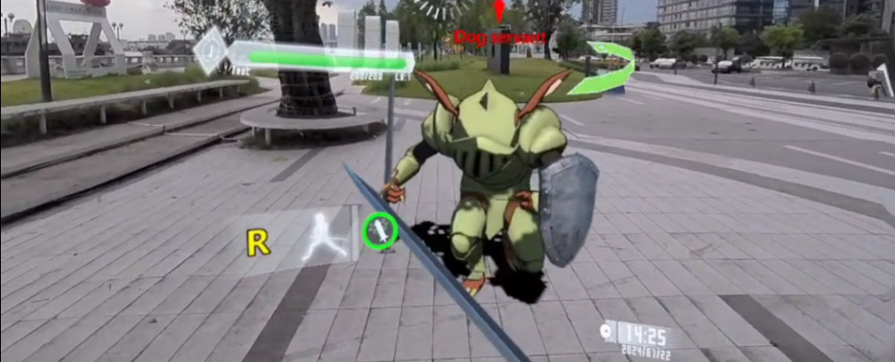

# SubspaceHunter-SAO

<h3 align="center">
<a href="README.md">中文</a> | English
</h3>

  

SubspaceHunter-SAO is an open-source and commercially usable Unity XR (VR+MR) action game project framework, including original commercially usable art assets, code, VFX, UI, and related project content. It is built around SAO-inspired interaction, combat, and scene experiences.
The project was developed and released for free in 2022 by Hexin Wang, who was 22 years old at the time, while he was living in a UCAS university dormitory. The SAO VR, Sword Art Online VR, and 2023 Quest 3 SAO videos circulated on social media in China and abroad all came from this project.
The original goal was to build a fully immersive, brain-computer-interface-based, massive multiplayer virtual world. Because the technology was not mature at the time and AI had not yet emerged, that large-scale plan could not be completed by one person alone. In 2026, Hexin Wang turned toward World Model entrepreneurship and founded Cardinal AI, hoping to use AIGC capabilities to solve the production bottleneck for large-scale interactive 3D content and allow everyone to create their own 3A worlds. This project will serve as an official tutorial and best-practice case for Cardinal AI, teaching how to develop a VR multiplayer online action game through tutorials.

## What You Will Learn / Get
1. How to set up development and environment configuration for XR standalone devices such as Meta Quest
2. How to optimize VR scene performance and rendering
3. Physics-based melee sword combat, magic combat, and firearm combat systems
4. Enemy physical hit-feel simulation, including hit VFX and sound effects
5. Nine extensible enemy behavior-tree AI combat logic patterns, including skill design, distance control, and animation control
6. Handling and optimization of particle VFX systems on XR devices
7. XR-native hand-tracking UI interaction and UI animation construction
8. Environment-integrated shadow handling in MR scenes
9. XR device streaming, debugging, and development
10. 9 level scenes, multiple weapons and props, and more than a dozen art assets for soldier-level, lord-level, and boss-level enemies in different styles
11. How to use Cardinal AI to generate voice-over, music, 3D models, UI, and other AIGC content to assist development 
https://www.bilibili.com/video/BV13h4y1B71P/ 
https://www.bilibili.com/video/BV1za41197PR/ 
https://www.bilibili.com/video/BV1jX4y1H76f/ 
https://www.bilibili.com/video/BV1mW421X7jg/ 

## Open-Source, Commercially Usable Assets

Original art assets are centralized under: `Assets/SubspaceHunter/Model/SubspaceHunter-model`

The UI interaction, animations, physical system simulations, combat logic, and behavior-tree design in this project are original and may be used commercially.

## SAO Assets Made by the Hexin Wang Team, Not for Commercial Use and Only for Learning / Communication

Heathcliff, The Gleam Eyes, Kobold Lord, stone golem, man-eating flower, Nicolas the Renegade, kobold knight, and boar.

## Third-Party Asset Packages Require Authorization for Commercial Use

When the project involves third-party asset packages, plugins, SDKs, and libraries, users must confirm the authorization scope, purchase status, and redistribution terms before commercial use. The current audit checklist is available at [docs/THIRD_PARTY_ASSET_PACKAGES.zh-CN.md](docs/THIRD_PARTY_ASSET_PACKAGES.zh-CN.md).

## Project Architecture and Feature Logic

For code modules, public demo scene entry points, and the battle, enemy, weapon, skill, UI, and data systems, see [docs/ARCHITECTURE.md](docs/ARCHITECTURE.md).

## Unity Version

- Unity Editor: `2021.3.45f1`
- Main target platforms: Android / Quest / PCVR devices
- XR-related packages: Oculus XR, OpenXR, XR Management

## Quick Start

1. Download the GitHub repository assets 
2. Open the project with Unity `2021.3.45f1` 
3. Download the asset UnityPackage: https://pan.baidu.com/s/15FRPMi91qJzsarMVTewV6g?pwd=bx4w extraction code: bx4w 
4. Import the UnityPackage into the project 

## Cardinal AI | World-Model-Driven Agent for 3D Interactive Content Generation

1. Official website: https://www.cardinal-agi.com/ 
2. Demo video: https://www.bilibili.com/video/BV18ERbBNENp/ 

## Contributor Notes

- Do not commit `Library/`, `Temp/`, `Logs/`, `UserSettings/`, `.csproj`, or `.sln` files.
- Use Git LFS only for large binary assets that are confirmed redistributable.
- Keep corresponding `.meta` files when committing Unity assets.
- Do not commit API keys, service credentials, signing files, private databases, or other sensitive information.
